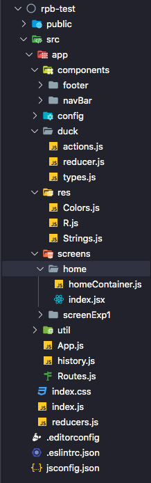

# React-project-builder
rpb allows you to create a new reactjs project (like a starter) very fast, and lets you add a new screen with a simple command line.
it's very simple to use, and should be installed once as being a general module

## Install
```bash
npm install react-project-builder -g 
```

## Create project :
``` bash
rpb init-project --name projectName --use-redux yes 
```

by default --use-redux value is `no` if you don't want to create a project using redux
The created project will have : 
* A starter with good organisation of the folders;
* Navbar,footer and home component preconfigured with react-router;
* Pre-configured eslint and prettier;
* A better way to use imports : you don't need to use relative imports ("../../components/navBar => @components/navBar)
  
The project organisation using redux : 



## Add a screen to the existing project : 

```bash
rpb add-screen --name screenTest2 --path /ScreenTest2 --use-redux yes
```

This command line will :
* create a screen folder and its component 
* update the router with the new screen


## License
MIT © [AmineVolk](https://github.com/AmineVolk)